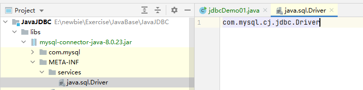

# 1.JDBC概念

**Java DataBase Connectivity** Java数据库连接，java语言操作数据库。

Sun公司开发了的**`JDBC`**，定义了一套操作所有关系型数据库（`MySQL`、`Oracle`、`DB2`……）的规则，即接口。各个数据库厂商去实现这套接口，提供数据库驱动 jar 包。这套接口（JDBC）编程真正执行的代码是驱动 jar 包中的实现类。


# 2.快速入门

1. 下载 JDBC 安装包https://blog.csdn.net/qq_41548028/article/details/94699237
2. 导入驱动 jar 包
   1. 复制`mysql-connector-java-8.0.23.jar`到项目的`libs`目录下
   2. 右键libs-->`Add As Library`
3. 注册驱动
4. 获取数据库连接对象`Connection`
5. 定义`sql`
6. 获取执行 sql 语句对象`Statement`
7. 执行 sql， 接受返回结果
8. 处理结果
9. 释放资源

```java
public class jdbcDemo01 {
    public static void main(String[] args) throws Exception {
        //1.导入驱动jar包
        //2.注册驱动
        Class.forName("com.mysql.cj.jdbc.Driver");
        //3.获取数据库的连接对象
        //Connection conn = DriverManager.getConnection("jdbc:mysql://localhost:3306/test","root","000000");
        Connection conn = DriverManager.getConnection("jdbc:mysql:///test","root","000000");
        //4.定义一个sql语句
        //String sql = "update account set balance = 200 where id = 1;";
        String sql = "update account set balance = 2000;";
        //5.获取执行sql语句的对象
        Statement stmt = conn.createStatement();
        //6.执行sql
        int count = stmt.executeUpdate(sql);
        //7.处理结果
        System.out.println(count);
        //8.释放资源
        stmt.close();
        conn.close();
    }
}
```


# 3.详解各个对象

## 3.1 `DriverManager`：驱动管理对象

##### 功能

1. 注册驱动：告诉程序应该使用哪一个数据库驱动 jar 包。

   `public static void registerDriver(Driver driver) `：注册给定的驱动程序的 DriverManager。

   写代码使用：`Class.forName("com.mysql.jdbc.Driver");`说明加载类之后有一些代码（静态代码块）会被执行。

   > 通过查看源码发现：在`com.mysql.jdbc.Driver`类中存在静态代码块
   >
   > - 这个旨在老版本（1.8）中能看到，新的（1.13）中`com.mysql.jdbc.Driver`这个类已经弃用了。
   > - 新的类是`com.mysql.cj.jdbc.Driver`，文件路径是`mysql-connector-java-8.0.23\mysql-connector-java-8.0.23\src\main\user-impl\java\com\mysql\cj\jdbc\Driver.java`。
   >
   > ```java
   > static {
   >         try{
   >             java.sql.DriverManager.registerDriver(new Driver());
   >         };catch(SQLException E){
   >             throw new RuntimeException("Can`t register driver!")
   >         }
   >     }
   > ```
   >
   > 注：mysql5 之后的驱动 jar 包可以省略注册驱动的步骤
   >
   > 

2. 获取数据库连接

   方法：`static Connection getConnection(String url, String user, String password)`

   参数：

   ​		url：数据库地址和端口号。

   - 语法：`jdbc:mysql://ip地址(域名):端口号/数据库名称`

   - 示例：`jdbc:mysql://localhost:3306/test`

   - 注意：如果链接的是本机的msql服务器，并且mysql服务默认端口是3306，则url可以简写为`jdbc:mysql:///数据库名称`。

      ​		user：用户名

      ​		paaword：密码

## 3.2 `Connection`：数据库连接对象

##### 功能

 	1. 获取执行 sql 的对象
     - `Statement createStatement()`
     - `PreparedStatement preparedStatement (String sql)`
 	2. 管理事务
     - 开启事务`void setAutoCommit(boolean autoCommit)`；调用该方法设置参数为`false`，即开启事务。
     - 提交事务`void commit()`
     - 回滚事务`void rollback()`

## 3.3 `Statement`：执行 sql 的对象

##### 功能

 1. 执行 sql

    - `boolean execute(String sql)`：可以执行任何 sql 语句，如果是`true`结果是一个`ResultSet`对象，`false`是更新计数或没有结果。

    - `int executeUpdate(String sql)`：执行 DML（insert、delete、update） 语句、DDL（create、alter、drop）语句【不常用，通常使用sql创建表】

      **返回值**：受到影响的行数，可以通过这个来判断 DML 语句是否执行成功（返回值>0则执行成功）。
    
    - `ResultSet excuteQuery(String sql)`：执行 DQL（select）语句。

##### 练习

1. account 表 添加一条记录

 	2. account 表 修改一条记录
 	3. account 表 删除一条记录

## 3.4 `ResultSet`：结果集对象，封装查询结果

##### 方法

	- `next()`：游标向下移动一行，判断当前行是否是最后一行末尾（是否有数据），如果是则返回false，如果不是则返回true。
 - `getxxx()`：获取数据。
   	- `xxx`代表数据类型。
   	- 参数：`Int`：代表列的编号，从1开始，如`getString(1)`；`String`：代表列的名称，如`getDouble("balance")`。

##### 练习

​	定义一个方法：查询 emp 表的数据将其封装成对象，然后装载集合，然后打印。

	1. 定义一个 Emp 类。
 	2. 定义一个方法 `public List<Emp> findAll(){}`。
 	3. 实现方法 `select * from emp`。

Emp.java

```java
package cn.melissa.domain;

import java.util.Date;

/**
 *  封装 emp 表数据的 JavaBean
 */
public class Emp {
    private int id;
    private String ename;
    private int job_id;
    private int mgr;
    private Date joindate;
    private double salary;
    private double bouns;
    private int depy_id;

    public int getId() {
        return id;
    }

    public void setId(int id) {
        this.id = id;
    }

    public String getEname() {
        return ename;
    }

    public void setEname(String ename) {
        this.ename = ename;
    }

    public int getJob_id() {
        return job_id;
    }

    public void setJob_id(int job_id) {
        this.job_id = job_id;
    }

    public int getMgr() {
        return mgr;
    }

    public void setMgr(int mgr) {
        this.mgr = mgr;
    }

    public Date getJoindate() {
        return joindate;
    }

    public void setJoindate(Date joindate) {
        this.joindate = joindate;
    }

    public double getSalary() {
        return salary;
    }

    public void setSalary(double salary) {
        this.salary = salary;
    }

    public double getBouns() {
        return bouns;
    }

    public void setBouns(double bouns) {
        this.bouns = bouns;
    }

    public int getDepy_id() {
        return depy_id;
    }

    public void setDepy_id(int depy_id) {
        this.depy_id = depy_id;
    }

    @Override
    public String toString() {
        return "Emp{" +
                "id=" + id +
                ", ename='" + ename + '\'' +
                ", job_id=" + job_id +
                ", mgr=" + mgr +
                ", joindate=" + joindate +
                ", salary=" + salary +
                ", bouns=" + bouns +
                ", depy_id=" + depy_id +
                '}';
    }
}
```

Demo07.java

```java
package cn.melissa.jdbc;

import cn.melissa.domain.Emp;

import java.sql.*;
import java.util.ArrayList;
import java.util.Date;
import java.util.List;

public class jdbcDemo07 {
    public static void main(String[] args) {
        List<Emp> list = new jdbcDemo07().FindAll();
        System.out.println(list);
        System.out.println(list.size());
    }

    /**
     * 查询所有 Emp 对象
     * @return
     */
    public List<Emp> FindAll(){
        Connection conn = null;
        Statement stmt = null;
        ResultSet rs = null;

        List<Emp> list = null;
        try {
            Class.forName("com.mysql.cj.jdbc.Driver");  //注册驱动这一行加上，可以向下兼容，因为jdbc5之后才帮助我们自动注册驱动
            conn = DriverManager.getConnection("jdbc:mysql:///test", "root", "000000");
            String sql = "select * from emp";
            stmt = conn.createStatement();
            rs = stmt.executeQuery(sql);
            //6.遍历结果集，封装对象，装载集合
            //创建集合
            list = new ArrayList<Emp>();
            while (rs.next()){
                //获取数据
                int id = rs.getInt("id");
                String ename = rs.getString("ename");
                int jod_id = rs.getInt("job_id");
                int mgr = rs.getInt("mgr");
                Date joindate = rs.getDate("joindate");
                Double salary = rs.getDouble("salary");
                Double bouns = rs.getDouble("bouns");
                int dept_id = rs.getInt("dept_id");
                //创建 Emp 对象并赋值
                Emp emp = new Emp();
                emp.setId(id);
                emp.setEname(ename);
                emp.setJob_id(jod_id);
                emp.setMgr(mgr);
                emp.setJoindate(joindate);
                emp.setSalary(salary);
                emp.setBouns(bouns);
                emp.setDepy_id(dept_id);
                //装载集合
                list.add(emp);
            }
        } catch (ClassNotFoundException e) {
            e.printStackTrace();
        } catch (SQLException throwables) {
            throwables.printStackTrace();
        }finally {
            try {
                if (rs != null){
                    rs.close();
                }
            } catch (SQLException throwables) {
                throwables.printStackTrace();
            }
            try {
                if (stmt != null){
                    stmt.close();
                }
            } catch (SQLException throwables) {
                throwables.printStackTrace();
            }
            try {
                if (conn != null){
                    conn.close();
                }
            } catch (SQLException throwables) {
                throwables.printStackTrace();
            }
        }
        return list;
    }
}
```

## 3.5 `prepareStatement`：执行 sql 的对象


## 3.6 抽取JDBC工具类 ：JDBCUtils

##### 目的

​	简化书写。

##### 分析

​	抽取重复度高的代码。

 1. 注册驱动也抽取。

 2. 抽取一个方法获取连接对象。

    **需求**：不想传参，还得保持工具类的通用性。

    **解决**：使用配置文件动态获取不同连接对象。

    ​		jdbc.properties

    ​				url=

    ​				user=

    ​				password=

 3. 抽取一个方法释放资源。

* 静态代码块只能处理异常，不能抛出异常，需要借助于方法才能声明异常。